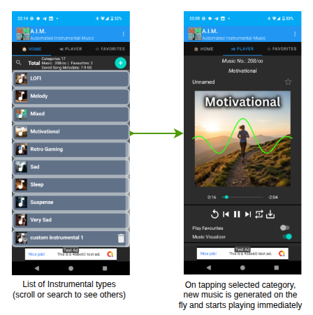
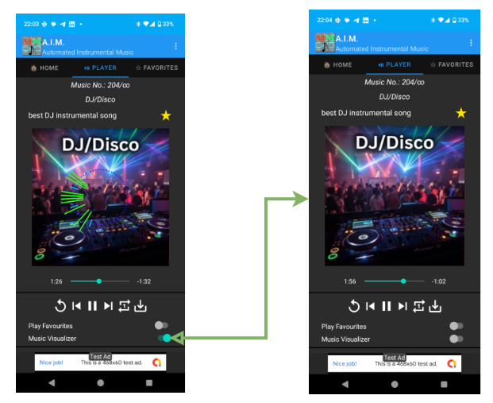
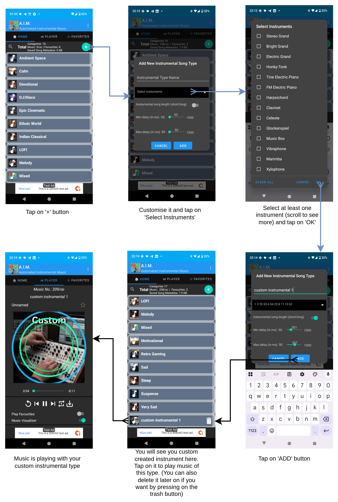
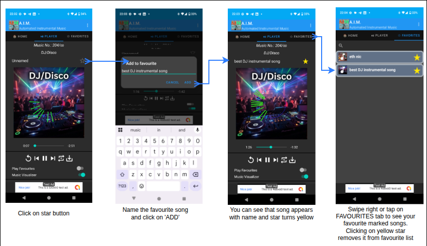
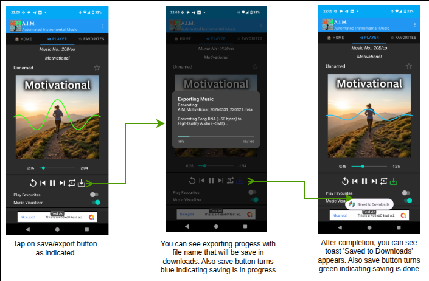
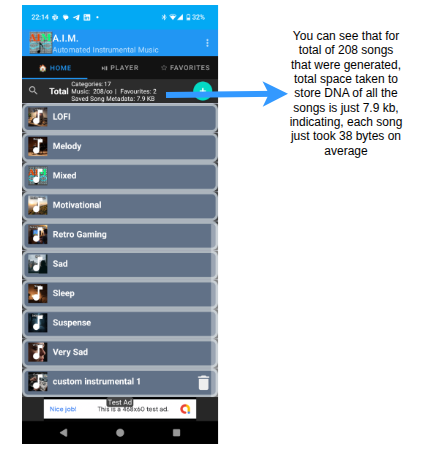
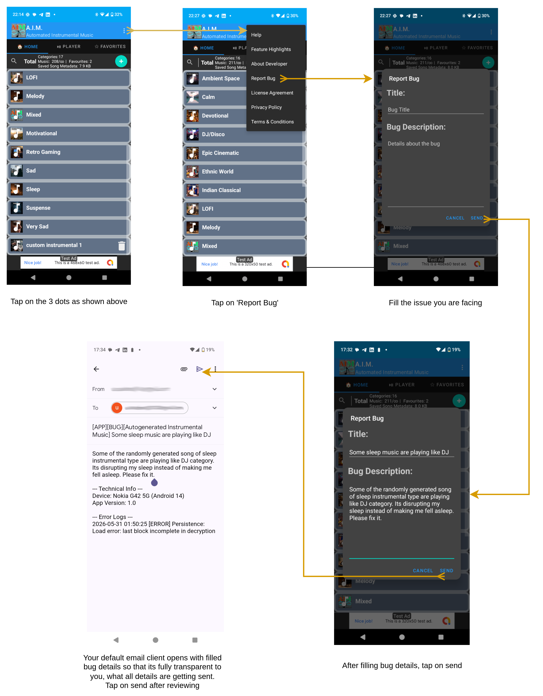

# User Guide & Help

Welcome to **Automated Instrumental Music**, your AI-powered fractal music companion. 

### 🚀 Zero Latency Composition
Unlike traditional AI music generators that require lengthy "rendering" or "cloud processing" times, our engine uses a **Real-Time Fractal Algorithm**. This allows the app to compose and play entirely new, unique melodies **instantly on the fly**. The moment you tap a genre, the music begins—no waiting, no buffering. All processing happens **locally on your device**, ensuring total privacy and offline accessibility.

### 💎 Truly Free Experience
We believe in transparent access to creativity.
- **No Hidden Costs:** There are no in-app purchases (IAPs), no locked features, and no "pro" subscriptions. 
- **Full Access:** Every instrument, every genre, and every export feature is available to you immediately and for free.

### 🎼 Music Quality & AI
While our fractal engine is highly advanced, it's important to remember that auto-generated music is a mathematical process and cannot yet fully replace the nuances of human composers. Because every song is unique, you might occasionally encounter a melody that doesn't perfectly suit your taste. In such cases, feel free to **skip to the next song**, explore a **different category**, or experiment with your own **custom category** to find the perfect sound!

#### 🎵 Generation Sample
Here is an example of a high-quality track exported directly from the app:

https://raw.githubusercontent.com/UTSAV-DEEP/app-docs/main/aim/samples/aim_featured_sample.m4a

*Note: The app generates these melodies instantly without any pre-recorded loops.*

### 🎨 Visual Assets & AI
All category images and visual assets within the app are AI-generated. Any pictures featuring human faces or figures are entirely synthetic and do not represent any real individual. Therefore, they do not violate the privacy rights of any person. Any resemblance to real persons, living or dead, is purely coincidental.

## 1. Musical Genres (Categories)
Choose from various curated categories to change the mood:
- **Calm/Sleep:** Soft, meditative textures using woodwinds and soft pianos.
- **DJ/Disco:** High-energy synth leads and heavy rhythmic basses.
- **Indian Classical:** Simulated Sitar, Shenai, and Tabla rhythms.
- **LOFI:** Mellow jazz guitars and ambient textures.
- And many others...

*Displays the various musical categories available*

## 2. Active Player & Visualizer
The app uses a **Fractal Binary Algorithm** to generate unique MIDI sequences in real-time. This entirely **local process** ensures your device is the composer, with no data ever leaving your phone for music generation.
- **Dynamic Visualizer:** Watch the music come to life with multiple visualization modes, including wavy lines, frequency bars, and rhythmic "dancing" figures. You can toggle the visualizer on or off in the Player screen to save battery.
- **Mood-Aware Visuals:** The app automatically filters visualizers based on the music genre. Relaxing categories (like Sleep or LOFI) use clean, abstract visuals to maintain focus, while energetic categories (like DJ/Disco) include lively dancing characters.
- **Main Part:** The song builds up in complexity following a mathematical pattern.
- **Ending:** The song automatically simplifies its structure and fades out for a natural finish.

*Shows real-time generated visualizer and effect of visualizer toggle*

## 3. Creating Your Own Genre
You can create a custom category by clicking the **"+"** button on the Home screen. You can select specific instruments and set the tempo (delay) for your unique style.

*Flow showing how users can create custom instrumental type*

## 4. Favorites & History
If you like a particular generated song:
1. Tap the **Star** icon on the Player screen.
2. Give your song a name.
3. Access it anytime from the **Favorites** tab.

*Add to favourites flow*

## 5. Exporting Music
You can save any song as a high-quality **M4A** file to your device's Downloads folder by tapping the **Save/Export** button. These files include full metadata and album art!

*Flow for exporting music as m4a to downloads folder*

## 6. Storage Efficiency
Unlike other music apps, we don't store bulky audio files on your device for your song history.
- **Compact Metadata:** We only save the "DNA" (mathematical parameters) of each song.
- **Tiny Footprint:** Each generated song metadata is **extremely small (approx. 50 bytes)**.
- **Instrument Library:** To provide high-quality sound offline, the app requires a SoundFont library (~30MB). We store this in the **Cache** rather than User Data. This keeps your personal "User Data" storage low.
- **Growth Projection (Total Saved State):**
  - 1,000 songs: ~50 KB
  - 10,000 songs: ~500 KB
  - 100,000 songs: ~5 MB
- **Smart Cache Management:** 
    - The SoundFont is kept in the cache for maximum performance, so the app doesn't have to re-copy it on every launch. 
    - Because it is in the "Cache" category, the Android system can automatically reclaim this space if your device runs low on storage.
    - Other temporary data (Ads, WebViews) are proactively cleared on every exit.
- **Transparent Growth:** Total app footprint is typically around 80MB to 95MB.

*Visual proof of under 50-byte efficiency*

---
**Need Support?**
If you encounter any issues, use the "Report Bug" option in the menu or contact the developer via the "About Developer" section.

*Bug report screen*

